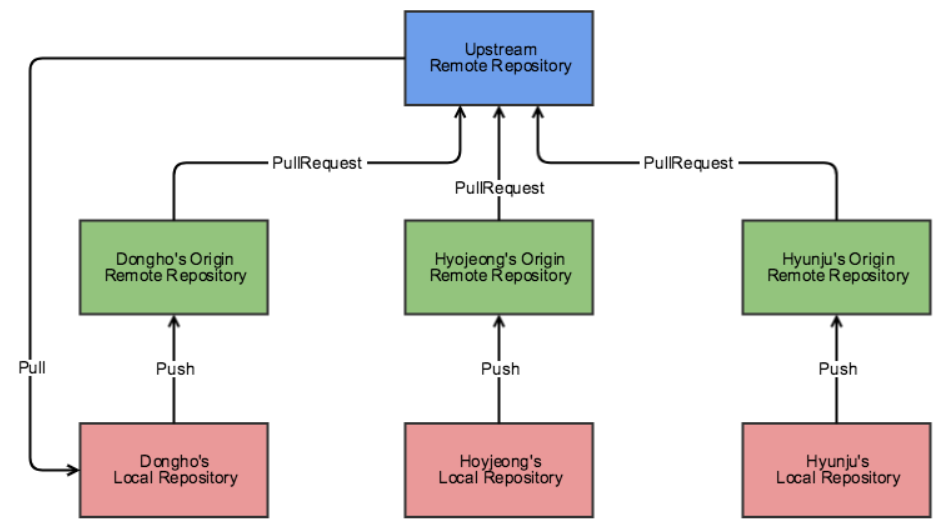

# 서론

> 이 게시물은 [우아한 형제들 git-flow](https://woowabros.github.io/experience/2017/10/30/baemin-mobile-git-branch-strategy.html) 자료를 참고하였습니다.

이번에 10명 규모의 스타트업에 프론트엔드 신입 포지션으로 입사를 했습니다. 현재 입사를 하고 한달째 되었는데요.
3주간 회사 코드와 업무 프로세스를 파악하고 회사 소개페이지를 만드는 일을 맡게 되었습니다.

분량은 1.5 페이지 정도 되는 작은 프로젝트였지만 프로젝트 구성부터 배포까지 해야되기에 저에게는 나름 큰 일이었습니다. 딱히 막히는 작업은 없었지만 작업하던 중 큰 실수를 몇개 했는데요

나중에 알았지만 git init한 위치가 잘못되어서 git에서 인식하는 프로젝트의 루트 위치가 잘못되었다는걸 깨달았습니다.
제대로 된 위치에서 다시 git init을 하니 기존의 커밋 데이터는 날아가고, 푸시를 했는데 `related branch`라는 에러가 났습니다.

여기서 아시는 분들은 아시겠지만 `git push origin +develop`처럼 브랜치 앞에 `+`를 붙이면 푸시하려는 브렌치의 기존 커밋은 지워버리고 강제 푸시되는 키워드가 있습니다. 제가 그렇게 해서 develop의 이전 커밋들을 날려먹었습니다.

이후 사수분께서 `git rebase`를 써서 브랜치 구조만이라도 복구를 시켜주셨는데요. 결국, 이번 일을 계기로 `git flow`를 다시 공부해야 겠다는 생각이 들었습니다.

서론이 길었지만, 결국 git flow를 배우는 거는 같이 협업을 하는 사람들을 위한 매너를 배우는 일이 아닐까 생각합니다.

### 협업 할 때 지켜야 하는 매너

배달의 민족에서는 협업할 때 지켜야 하는 매너가 몇가지 있다고 합니다.

1. 작업을 시작하기 전에 JIRA 티켓을 생성합니다.
2. 하나의 티켓은 되도록 하나의 커밋으로 합니다.
3. 커밋 그래프는 최대한 단순하게 가져갑니다.
4. 서로 공유하는 브랜치의 커밋 그래프는 함부로 변경하지 않습니다.
5. 리뷰어에게 꼭 리뷰를 받습니다.
6. 자신의 Pull Request는 스스로 merge 합니다.

제가 몸담고 있는 회사는 현재 JIRA 대신에 Trello로 이슈 관리를 하고 있는데요. 결국, 핵심은 기능단위로 브랜치를 따며, 이슈단위로 커밋하고 develop, release, master와 같은 공유 브랜치의 커밋은 건드리지 말자는 이야기입니다.

아래 사진에서 보면 매너를 지켜야할 upstream branch는 파랑색 repository를 말합니다.

# Git Flow 전략 톺아보기

Git-flow의 브랜치 종류는 프로젝트 구성에 따라 다양하지만 대중적으로 사용하는 브랜치는 다음과 같습니다.

1. master : 제품으로 출시될 수 있는 브랜치
2. develop : 다음 출시 버전을 개발하는 브랜치
3. feature/기능명 : 기능을 개발하는 브랜치
4. release : 이번 출시 버전을 준비하는 브랜치
5. hotfix : 출시 버전에서 발생한 버그를 수정 하는 브랜치

이 브랜치들은 아래 그림과 같은 순서로 git-flow를 진행합니다.

먼저 master -> develop 브랜치 순으로 프로젝트 초기설정을 합니다. 그러면 각각의 개발자들이 develop 브랜치에서 포크하고 이슈/기능 단위로 업무를 가져가서 feature 브랜치를 만듭니다.
feature 브랜치는 언제나 develop 브랜치로부터 생성되고 기능구현이 완료되면 develop 브랜치로 pr을 날려서 코드를 합칩니다. 그렇게 develop에 머지가 되었다면 qa를 하기 위해 release 브랜치를 만듭니다. qa가 성공하면 release 브랜치를 master와 develop 브랜치로 머지합니다.
마지막으로 출시된 **master branch에 버전 태그를 추가**합니다.

# Git Flow 전략 깊게보기

## 1. 티켓(기능) 처리하기

하나의 기능을 혼자서 개발할 수도 있지만 기능이 크다면 같이 개발해야 하는 경우가 발생합니다.

또한, 하나의 기능을 여러개의 이슈로 나누고 커밋은 하나의 이슈가 끝날 때마다 해야합니다. 이렇게 복잡한 상황속에서 feature 브랜치에서의 협업이 가능하도록 `git rebase`방식을 고려해 봅니다.

## 2. develop 변경사항 feature로 가져오기

작업을 할 때 브랜치의 수명은 되도록 짧게 가져가는 게 좋지만, feature 브랜치에서 기능을 완료하는데 해야 할 작업들이 많아서 오래 걸리는 경우 들이 있습니다. 그러다 보면 develop에 추가된 기능들이 필요한 경우가 종종 생기게 됩니다. 그럴 때는 feature 브랜치에 develop의 변경사항들을 가져와야 합니다.

## 3. 완료된 기능을 이번 출시 버전에 포함시키기

하나의 feature 브랜치가 완료되면 feature 브랜치를 이번 출시 버전에 포함시키기 위해서 develop 브랜치에 머지합니다.

## 4. QA 시작하기

이번 버전에 포함되어야 할 기능들이 모두 완료되었습니다. 이제부터 출시 담당자가 해야 할 일이 많습니다. 출시 담당자는 QA를 시작하기 위해 먼저 release 브랜치를 생성하고 upstream에 push하여 release 브랜치를 공유합니다.

## 5. QA 중 버그 수정하기

QA 중 예외 상황이 발생할 때마다 버그 티켓이 하나씩 생성되는데 이 티켓들을 모두 해결해야만 앱을 출시할 수 있습니다.
버그 티켓들도 티켓이기 때문에 ‘1. 티켓 처리하기’와 같은 방법으로 처리합니다.

## 6. 출시

발생하는 버그들을 모두 수정했다면 이젠 출시를 준비할 때입니다. release 브랜치를 master 브랜치와 develop 브랜치에 merge하고 마지막으로 master 브랜치에서 버전 태그를 달아줍니다.

# 결론

아직 git rebase에 익숙치 않아서 rebase 방식을 공부해 보아야 겠다. 항상 merge 방식으로 개발을 해서 그런지 공부하기 전부터 두려움이 가득하다.
