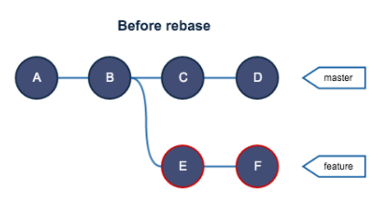
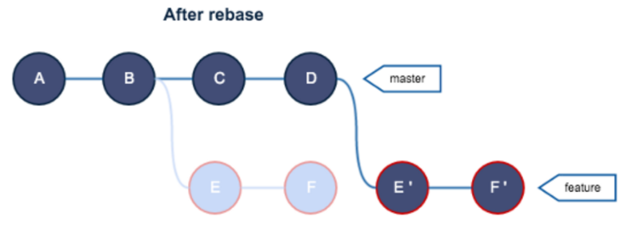

# 서론

아마 Git Merge방식은 Git을 좀 써본 사람이라면 누구나 사용해 본 방식일 거라고 생각합니다.

저는 rebase의 용도를 처음 들었을 때 굉장히 어렵고 고급진 방법이라고 생각을 했는데요. 공부를 시작하고 나서는 익숙해지면 정말 쉽겠다는 생각이 들었습니다.

# Git Rebase

`re + base`는 말 그대로 **base를 재설정한다**는 의미입니다. 여기서 말하는 base는 'branch'에 대한 base입니다.

아래 사진에 다음과 같은 branch의 commit 구조가 있다고 생각해 봅시다.



feture라는 브랜치는 master 브랜치에서 파생된 브랜치입니다. feature를 작업하는 도중에 누군가 C-D 커밋을 master 브랜치에 푸시했습니다.

Merge 방식을 사용했던 사람은 아마 master 브랜치를 pull 해서 merge하는 방식을 사용할 것입니다. 하지만, 우리는 발상을 달리해서 E-F 커밋의 현재 base인 B를 D로 바꾸는 것으로 코드를 합치겠습니다.

```bash
# 현재 feature 브랜치에 있다
# 사용법은 간단하다 --rebase만 붙이면 된다.
git pull --rebase origin master
```

결과적으로 아래와 같은 모양이 나옵니다.



# Git Rebase 심화

## 1. Interactive Rebasing

`Interactive Rebasing` 은 Rebase 를 실행하기 전, 내가 **작업 중인 feature 브랜치의 commit history 를 조작**할 수 있게 해줍니다.

```bash
git rebase -i master
```

각각의 commit 들의 앞에 붙은 command 에 따라 조작이 이루어지며 각 command 는 설명 부분에 나열해보겠습니다..

- pick : 해당 commit 그대로 유지
- reword : 해당 commit 의 message 변경
- fixup : 해당 commit 을 없애고 코드 변경 사항은 바로 윗 commit 에 포함 시킴

Interative Rebasing 은 보통 불필요한 commit history 를 정리하기 위해 사용됩니다.

## 2. Local Cleanup

작업 중인 feature 브랜치의 commit 몇 개만의 history 를 수정하려면, git rebase 의 base 를 master 브랜치의 끝이 아니라 feature 브랜치의 이전 commit 중 하나로 정해주면 됩니다.

```bash
git rebase -i HEAD~3
```

위의 명령어로 HEAD 에서 3 단계 전의 commit 을 base 로 잡고 그 위의 commit 부터 history 를 re-write 할 수 있습니다.
**Rebase하기전이 아니라 단지, Local상에서 commit을 수정하는 장점이 있습니다.**

커밋 수정을 완료했으면 다음과 같은 방법으로 Rebase할 수 있습니다.

```bash
git merge-base feature master
git rebase -i origin-base
```

# Rebase를 사용하는 이유?

근데, 우리는 왜 쓰기 쉬운 Merge 방식을 냅두고 Rebase 방식을 사용하는 것일까요??

결론부터 말하면 브랜치의 히스토리가 깔끔해지기 때문입니다.

아래 사진은 극단적인 예시이기는 하지만, 비교하기에 적합한 사진이라 넣었습니다. 커밋 히스토리가 정말 깔끔해지지 않았나요??


# Rebase를 언제 사용해야 할까?

**Git Rebase 는 다른사람과 같이 사용하는 master, develop 같은 브랜치에서는 절대로 사용하면 안됩니다.**

다른 팀원과 공유하는 브랜치를 rebase 할 경우, 해당 브랜치는 내 로컬에서만 전혀 다른 history 를 갖게 될 수도 있습니다.

이를 다시 다른 팀원들의 동일 브랜치와 합치려면 git merge 를 통해 새로운 merge commit 을 생성하는 것이 불가피하고 그뿐만 아니라 history 상에 동일한 code 변경 내용을 가진 history 가 중복으로 존재하게 될 수도 있습니다.

이를 해결하기 위해서는 `Git Revert`를 활용하는 것을 고려해야 합니다.

# 결론

- 만약 master 브랜치가 매우 빠르게 업데이트되고 있고 그에따라 feature 브랜치와 계속해서 merge 해야한다면 rebase 방식을 고려해 보는 것이 좋을 것 같습니다.

- `git log, git bisect 또는 gitk` 등의 명령어를 사용한 커밋 로그를 보는 것이 쉬워집니다.
